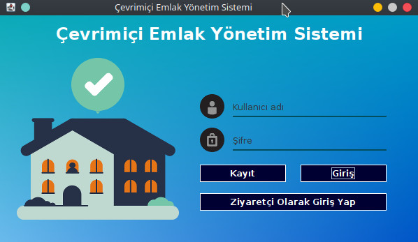
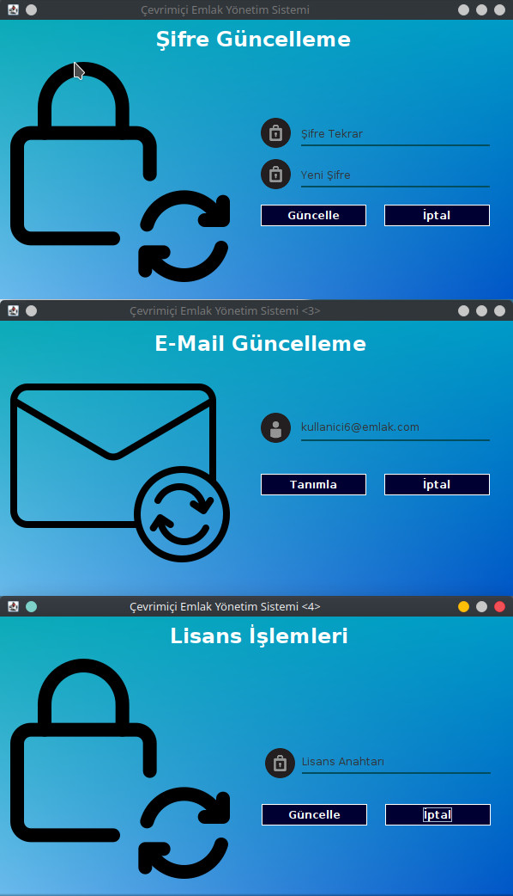
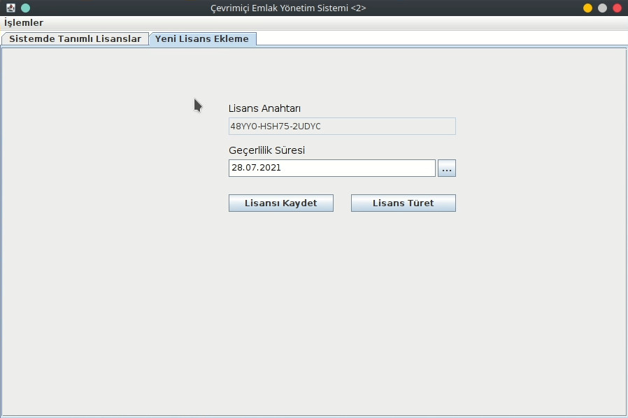
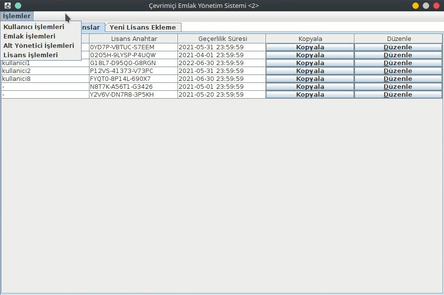
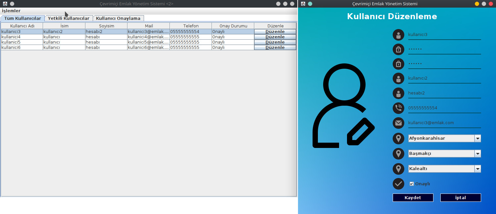
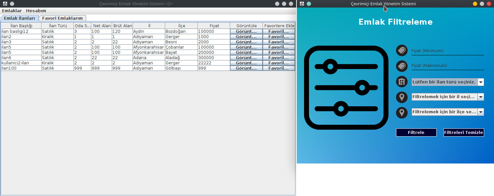
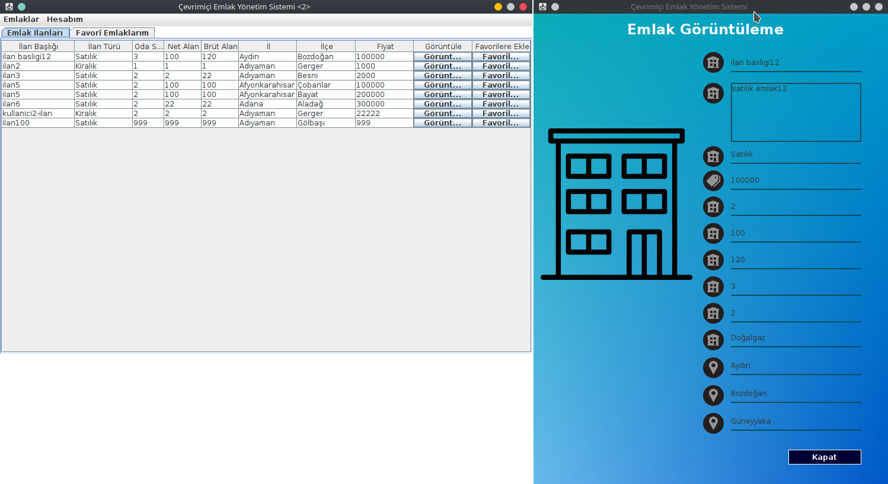

# BMB306 Yazılım Mühendisliği Çevrimiçi Emlak Yönetimi Ödevi

## Dipnot

- Kısıtlı zamana sahip olan bir ödev olduğu için kod kalitesi çok düşüktür.
- Uygulamanın server side tarafı, API katmanı, dolaylı olarak input validation kontrolleri mevcut değildir. Uzak bir mysql sunucusuna doğrudan client side bir uygulama ile bağlantı sağlanıldığı bir senaryo olarak baz alınmıştır. Güvenli yazılım geliştirme metodları hakgetiredir.

## Gereksinimler
  - MySQL Server
  - Eclipse IDE
  - JDK 1.8
## Kurulum
  - Öncelikle yerel mysql sunucusu kurulumu yapılır.
  - Kaynak kodun yanında paylaşılan SQL dosyası(EstateMS.sql) mysql sunucusuna aktarılır.
  - Kaynak kod Eclipse IDE'ye aktarılır.
  - Proje Eclipse IDE ile açılıp, Model paketi altındaki Model sınıfında bulanan mysql sunucusu bilgileri (mysql sunucusu adresi, portu, kullanıcı adı ve şifresi) düzenlenir.
  - Eclipse IDE üzerinde proje Maven build yapılıp çalıştırılır.
## Bağımlılık Yönetimi
  - Maven ile swing, mysql connector gibi bağımlılık paketleri maven depolarından temin edilir. Build işlemi haricinde ek bir işlem yapmanız gerekmemektedir.
## Demo

## Kendime notlar
https://www.youtube.com/watch?v=vcHDscPR9Vw
https://www.youtube.com/watch?v=Kmgo00avvEw
https://www.youtube.com/watch?v=ZN37BwCai7Q
https://docs.oracle.com/javase/tutorial/uiswing/layout/visual.html
https://www.guru99.com/java-swing-gui.html

JFrame => uygulama ekranı çerçevesini oluşturur.
JPanel => uygulama ekranı çerçevesi içerisinde bir alan oluşturur. (bkz : div)
JLabel => Yazı ekler
